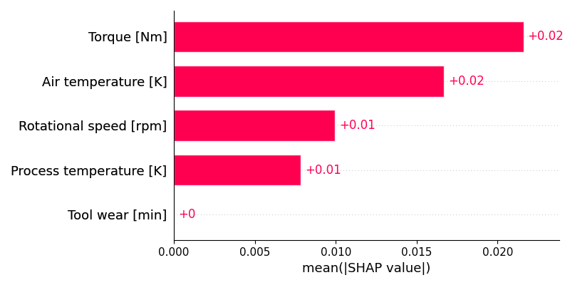

# 🧠 Predictive Maintenance using CNN with SHAP & LIME

This project demonstrates predictive maintenance using a Convolutional Neural Network (CNN) on sensor data, with **explainability** powered by **SHAP** and **LIME**.

---

## 🎯 Objective

- 🔍 Predict machine failure (Defect Status) — Binary classification (0: No Failure, 1: Failure)
- 📈 Estimate failure probability (Defect Rate) — Confidence score for potential failure
- 🧠 Understand model decisions using:
  - **SHAP** (SHapley Additive exPlanations)
  - **LIME** (Local Interpretable Model-Agnostic Explanations)

---

## 🛠 Tech Stack

| Category        | Tools / Libraries                            |
|----------------|-----------------------------------------------|
| **Language**    | Python 3.11                                   |
| **Modeling**    | Keras, TensorFlow (via backend)               |
| **Data**        | Pandas, NumPy, Scikit-learn                   |
| **Explainability** | SHAP, LIME                                |
| **Visualization** | Matplotlib                                 |

---

## 📊 Dataset

**Source:** [Kaggle - Predictive Maintenance Classification](https://www.kaggle.com/datasets/shivamb/machine-predictive-maintenance-classification)

**Features used:**
- Air temperature [K]
- Process temperature [K]
- Rotational speed [rpm]
- Torque [Nm]
- Tool wear [min]

**Target:**
- `Target` column: `0` = No Failure, `1` = Failure

---

## 🧠 Model Architecture

The model is a **Convolutional Neural Network (CNN)** built using Keras, with the following structure:

```

Conv2D(16 filters) → MaxPooling2D → Flatten
→ Dense(32) → Dropout(0.3) → Dense(2, softmax)

```

- Input Shape: `(5, 1, 1)` after reshaping
- Output: Probability of failure vs. no-failure

---

## 📈 Results

- ✅ **Validation Accuracy:** ~97%
- ⚠️ Strong performance for **No Failure** class (`0`)
- 🚨 Lower recall for **Failure** class (`1`) — typical for imbalanced datasets
- 📉 Suggestion: Use class weighting, resampling, or anomaly detection techniques to improve rare class prediction

**Sample Predictions:**

```

Sample 1: Defect Status = 0, Defect Rate = 0.0067
Sample 2: Defect Status = 0, Defect Rate = 0.0237
Sample 3: Defect Status = 0, Defect Rate = 0.0016
Sample 4: Defect Status = 0, Defect Rate = 0.0062
Sample 5: Defect Status = 0, Defect Rate = 0.0053

```

---

## 🧪 Explainability

### 🔹 SHAP (Global Explanation)

SHAP helps identify which features impact the model **on average** across multiple samples.



**Insights from SHAP:**
- `Torque [Nm]` and `Air temperature [K]` are the most influential features in predicting machine failure.
- `Rotational speed [rpm]` and `Process temperature [K]` have moderate impact.
- `Tool wear [min]` had minimal contribution in current evaluation.

### 🔸 LIME (Local Explanation)

LIME explains why a **specific instance** was predicted a certain way.

**Technical LIME Output:**
```

-0.68 < Torque \[Nm] <= -0.02: -0.0153
-0.17 < Rotational speed \[rpm] <= 0.42: -0.0121
0.05 < Air temperature \[K] <= 0.75: 0.0067
-0.00 < Process temperature \[K] <= 0.74: 0.0057
Tool wear \[min] > 0.90: 0.0022

```

**📝 Human-Friendly Interpretation:**
```

* Torque in a lower range reduced the predicted failure risk by approx 1.53%
* Rotational speed in the medium range reduced risk by approx 1.21%
* Higher air temperature slightly increased failure risk (\~0.67%)
* Process temperature and tool wear had minor effects (<0.5%)

````

LIME allows engineers to justify model predictions in **plain language**, helping improve trust and usability.

---

## 🧰 Setup Instructions

1. ✅ Clone or download the repository

2. 🐍 Create and activate a virtual environment (recommended):

```bash
# Create virtual environment
python3 -m venv env

# Activate environment
# On Windows
env\Scripts\activate

# On macOS/Linux
source env/bin/activate
````

3. 📦 Install dependencies:

```bash
pip install -r requirements.txt
```

4. ▶️ Run the main script:

```bash
python predictive_maintenance_explainer.py
```

On execution, the script will:

* Generate and save a **SHAP bar chart** as `shap_bar_plot.png`
* Print a **human-friendly LIME explanation** in the terminal

5. 🧹 To deactivate the environment when done:

```bash
deactivate
```

---

## 📁 Project Files

| File Name                         | Purpose                                   |
| --------------------------------- | ----------------------------------------- |
| `predictive_maintenance_explainer.py` | Main Python script with CNN + SHAP + LIME |
| `shap_bar_plot.png`               | Saved SHAP feature importance plot        |
| `requirements.txt`                | Python dependencies                       |
| `README.md`                       | This file                                 |

---

## 📍 Credits

* 📊 Dataset: Shivam Bansal ([Kaggle Dataset](https://www.kaggle.com/datasets/shivamb/machine-predictive-maintenance-classification))
* 👨‍💻 Author: **Chirag Sanghvi**

---

## 📜 License

This project is licensed under the MIT License. Feel free to use and modify as needed.

---
